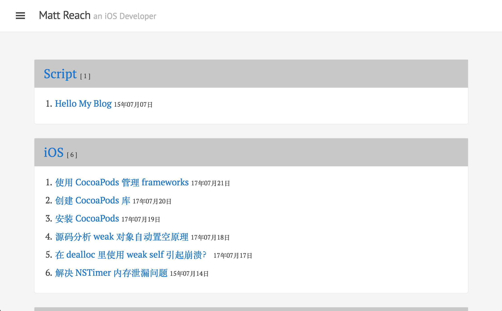
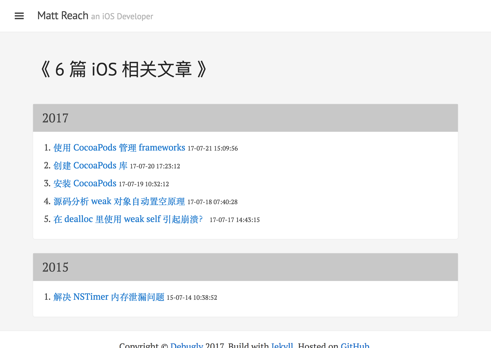
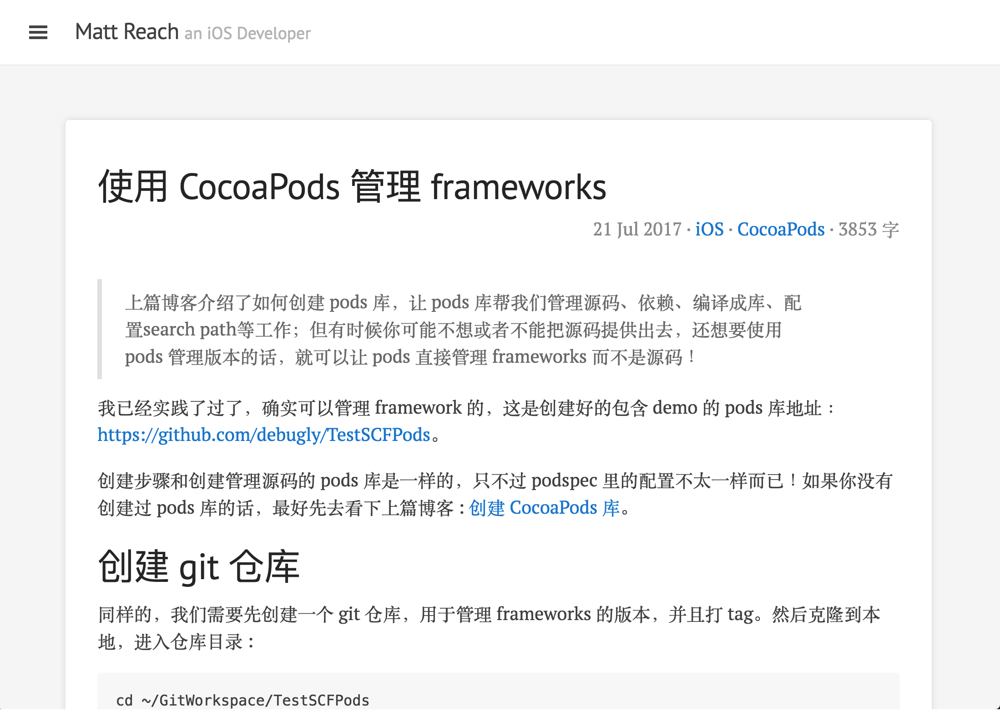

# Yaris

Yaris is an open source Jekyll theme, released under the MIT License. The author stole the idea from poole’s lanyon.

Visit my [blog site](http://debugly.cn) for more information.

Yaris is an unassuming [Jekyll](http://jekyllrb.com) theme that places content first by tucking away navigation in a hidden drawer. It's based on [Poole](http://getpoole.com), the Jekyll butler.

## License

Open sourced under the [MIT license](LICENSE.md).
